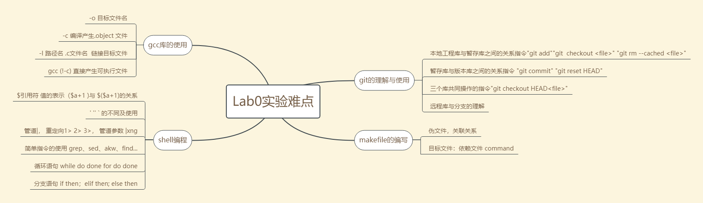
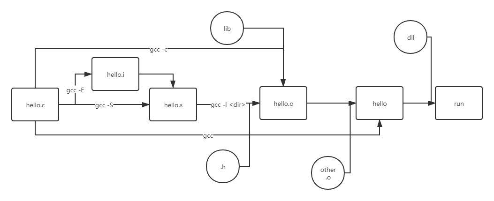

# lab0 实验报告


## 一. 思考题

#### 1. 过你的使用经验，简单分析 CLI Shell，GUI Shell 在你使用过程中的各自优劣（100 字以内）

GUI 优：易于普通用户上手，操作简便，可以给人以良好的视觉体验。

​        劣：运行对计算机计算力有一定要求，对显示界面的显示屏要求较高（占用CPU或独立的GPU进行运算），对于复杂的指令难以快速      			    完成。

CLI 优：对计算机要求较低，上手后可以快速执行较为复杂的命令。

​       劣：难以上手，对非程序员和系统用户不友好，在执行一些简单的命令时由于需要键盘输入命令而速度较慢


#### 2.  使用你知道的方法（包括重定向）创建文件（文件命名为test），将创建该文件的命令序列保存在command文件中，并将test文件作为批处理文件运行，将运行结果输出至result文件中。给出command文件和result文件的内容，并对最后的结果进行解释说（可以从test文件的内容入手） 具体实现的过程中思考下列问题echo Shell Start 与 echo 'Shell Start'效果是否有区别  echo \$c>file1 与 echo '\$c>file1' 效果是否有区别

.cammand

```shell
echo > test
echo 'echo Shell Start...' >>test
echo 'echo set a = 1' >>test
echo 'a=1' >>test
echo 'echo set b = 2' >>test
echo 'b=2' >>test
echo 'set c = a+b' >>test
echo '$[$a+$b]' >>test
echo 'echo c = $c' >>test
echo 'echo save c to ./file1' >>test
echo 'echo save b to ./file2' >>test
echo 'echo save $b>file2' >>test
echo 'echo save a to ./file3'
echo '$a>file3' >>test
echo 'save file1 file2 file3 to file4'
echo 'cat file1>file4' >>test
echo 'cat file2>>file4' >>test
echo 'file3>>file4'  >>test
echo 'sace file4 to ./result' >>test
echo 'echo save file4 to ./result' >>test
echo 'cat file4>>result' >>test
```

```shell
bash <test
```

执行 test 脚本，得到result的结果为

```
3
2
1
```

解释：创建 a, b, c变量并赋值，结果分别保存在file3，file2， file1中，再将file1 file2 file3合并保存在file4中，再cat file4 中的内容重定向到result中。

前者无区别，应为Shell Start 不包含linux的标识符；后者有区别，echo  \\$c>file1 将 "\\$c"保存在file1中，后者在shell中返回 “\\$c>file1”


#### 3.

add the file 对应 git add +文件名

stage the file 对应 git add +文件名 命令

commit 对应 git commit 命令

#### 4.

```git
1.git checkout printf.c
2.git reset HEAD printf.c && git checkout printf.c
3.git rm --cached Tucao.txt
```


#### 5. 思考下面四个描述，你觉得哪些正确，哪些错误，请给出你参考的资料或实验证据

1. **克隆时所有分支均被克隆，但只有HEAD指向的分支被检出。**

   正确， 实际上控制谁被默认检出，需要更改隐藏文件.git/refs/heads 中的内容为指定某个分支，设置后该分支即为HEAD指向的分支，当heads中的选定的分支被设置时(默认为master)，对应的分支将被检出并在本地工作库里展示。即任何时候，仅有HEAD指向的分支被检出并展示在本地工作库中。

2. **克隆出的工作区中执行 git log、git status、git checkout、git commit等操作不会去访问远程版本库。**

   正确，这些命令，均为本地库相关的命令，在本地库中的改变不会对远程库产生影响。在本地库的更改仅有git push后才可能改变远程库，只有类似git pull这样的命令会访问远程版本库并在本地进行更改。

3. **克隆时只有远程版本库HEAD指向的分支被克隆。**

   错误，实验可知，在任意空文件夹下执行git clone命令后，执行git branch -a命令可以看到所有的分支。且.git/objects文件下有远程库的所有被git重写的表示每个项目的二进制object文件。故克隆时应该是将远程版本库的所有分支均克隆。

4. **克隆后工作区的默认分支处于master分支。**

   正确，如图，在远程库创建master分支后删除本地库，然后在此文件夹下重新clone远程库

   

   在clone完后不进行checkout检出，即发现此时进行ls不为空（实际为master的内容），git branch -a可以发现，HEAD自动指向master分支。


## 二. 实验难点图示




这里重点总结下gcc将.c文件转化为可执行文件的全过程：



## 三. 体会与感悟

第一次OS实验主要是学习相关工具的使用，难度不是很大，但由于第一次尝试间使用linux 的 CLI(之前只是在cmd的命令行中零星地敲过几个指令)，所以还是花费了不少时间。尤其时在进行shell脚本编程时，由于之前习惯于高级语言编程中而常常出现诸如"、'、`、三种情况不分，不该有空格而打出空格的出错情况，长时间难以发现问题所在。当然，当较熟悉这些命令时，确实也发下linux CLI 及shell脚本编程的诸多优点：能够使熟练使用的用户快速便捷地操控文件；具有很好的扩展性，可以让用户自定义sh命令；shell命令方法形式多样，诸如管道、重定向等之前没有接触过的概念能够是我们快速地工作。对于其他工具而言，初次接触Makefile及其使用，体会到其基于类似AON网的组织和更新文件方法在开发较大的C语言工程中的重要意义。