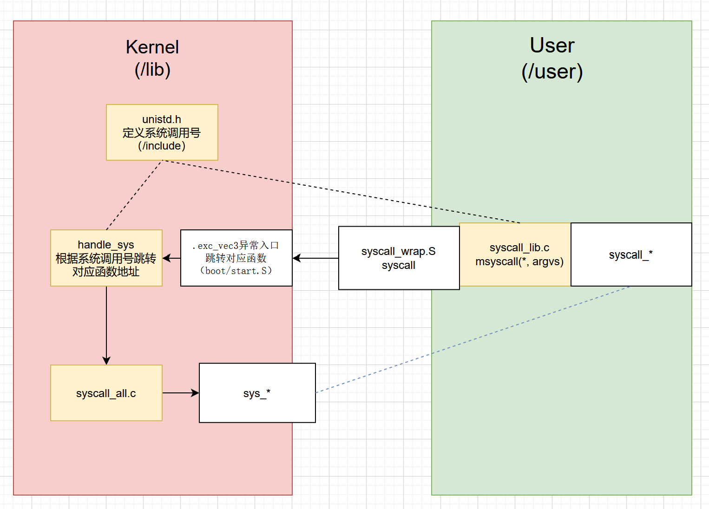
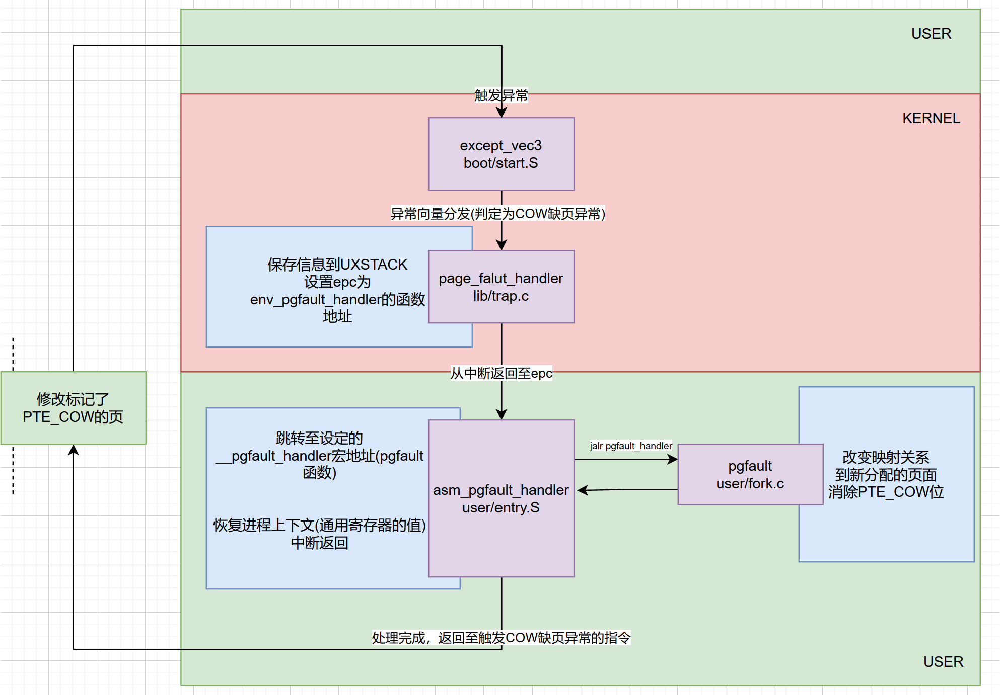
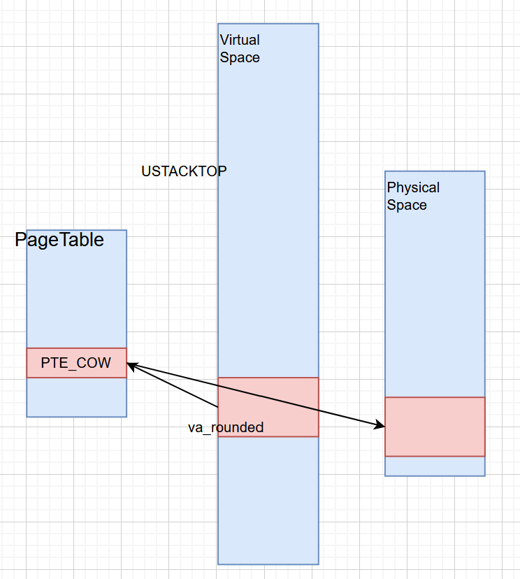
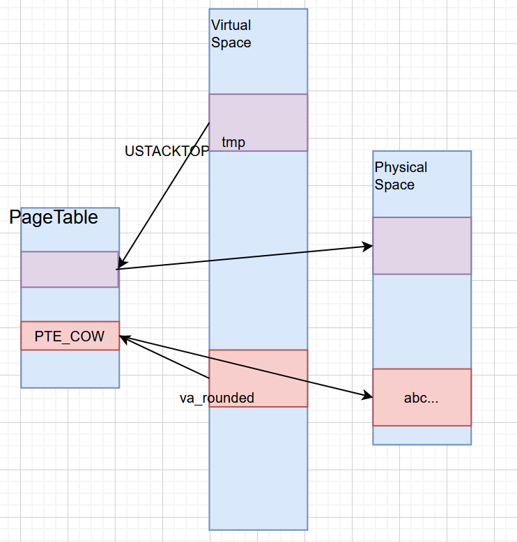
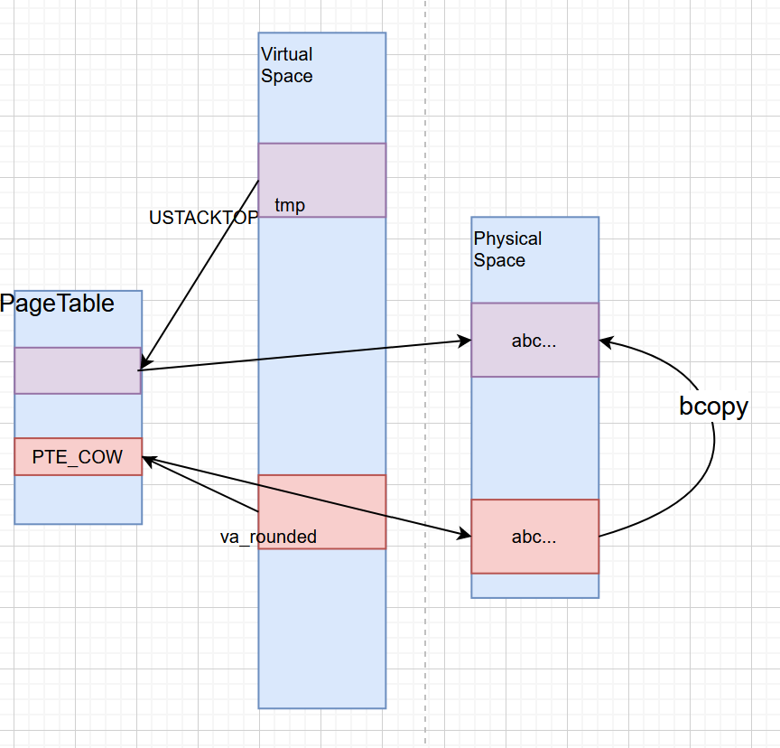
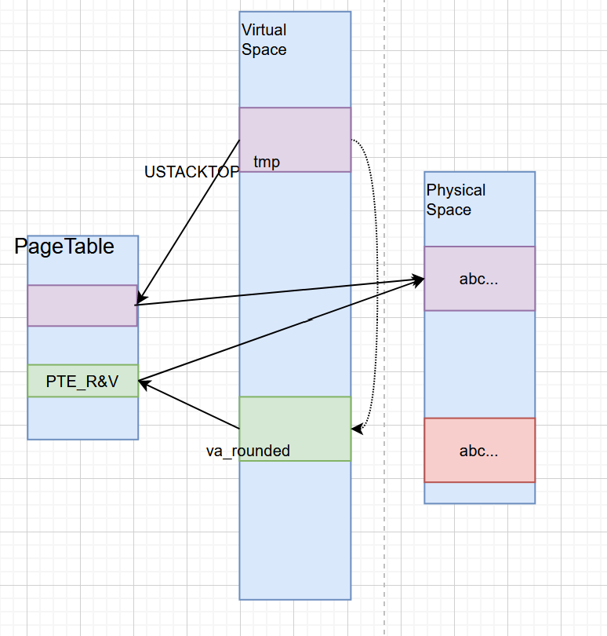
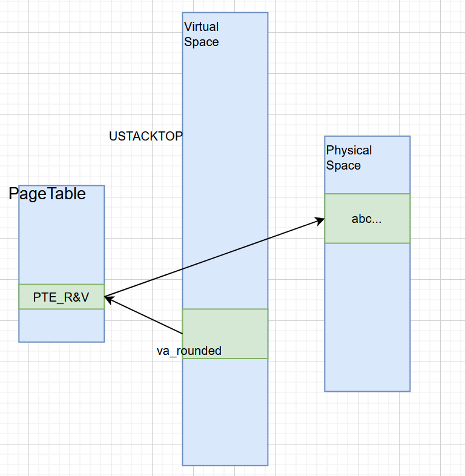

# OS-Lab4-ExpReport

## 一. 思考题

**1** 思考并回答下面的问题：

- 内核在保存现场的时候是如何避免破坏通用寄存器的?
- 系统陷入内核调用后可以直接从当时的$a0-$a3 参数寄存器中得到用户调用msyscall 留下的信息吗？
- 我们是怎么做到让sys 开头的函数“认为”我们提供了和用户调用msyscall 时同样的参数的？
- 内核处理系统调用的过程对Trapframe 做了哪些更改？这种修改对应的用户态的变化是？


通过SAVE_ALL宏函数保存所有通用寄存器的值到栈空间中，在内核返回时恢复。

不可以，陷入内核态后，在获得不同syscall的入口地址时，已经将a0寄存器的值修改为相对系统调用的num

```
lw a0, TF_REG4(SP)
addiu a0, a0, -__SYSCALL_BASE
```

可见参数寄存器并不能保证在整个系统调用过程中保持不变的值。因此应该从内核栈空间中读取syscall的参数。

先从内核栈中取出$a0, $a1, $a2, $a3的值，在从用户栈中取出后两个参数，将它们的值存入异常栈中。并修改栈指针。从而msyscall与sys函数具有相同的输入信息。即$a0-$a3、16(sp)、20(sp).

tf.epc += 4：从而syscall返回后会接着执行下一条指令。

tf.v0被修改为syscall返回值，即用户态函数接受了系统调用的返回参数。


**2** 思考下面的问题，并对这两个问题谈谈你的理解：

- 子进程完全按照fork() 之后父进程的代码执行，说明了什么？
- 但是子进程却没有执行fork() 之前父进程的代码，又说明了什么？


说明父子进程的内存映射当前装载的二进制镜像完全相同。

说明fork后产生的子进程与父进程的PC值也完全相同。


**3** 关于fork 函数的两个返回值，下面说法正确的是：

A. fork 在父进程中被调用两次，产生两个返回值

B. fork 在两个进程中分别被调用一次，产生两个不同的返回值

C. fork 只在父进程中被调用了一次，在两个进程中各产生一个返回值

D. fork 只在子进程中被调用了一次，在两个进程中各产生一个返回值

C


**4** 如果仔细阅读上述这一段话, 你应该可以发现, 我们并不是对所有的用户空间页都使用duppage 进行了保护。那么究竟哪些用户空间页可以保护，哪些不可以呢，请结合include/mmu.h 里的内存布局图谈谈你的看法。


UTEXT到USTACKTOP的部分需要进行保护。

USTACKTOP到UTOP的部分不可以保护：因为子进程与父进程的异常栈因当是不同的（子进程应当有一个新的错误栈）。

UTOP到ULIM的部分各个子进程仅具有读取的权利，因此不可以进行保护。

内核态空间所有用户进程在用户态下都不可访问。不可以进行保护。

除此之外，YTEXT到USTACKTOP的部分中，只读的页面不应该也不能进行保护，仅对于有效的、可写的或是已经设置了PTE_COW位的页面进行保护。


**5** 在遍历地址空间存取页表项时你需要使用到vpd 和vpt 这两个“指针的指针”，请思考并回答这几个问题：

> - vpt 和vpd 的作用是什么？怎样使用它们？
> - 从实现的角度谈一下为什么能够通过这种方式来存取进程自身页表？
> - 它们是如何体现自映射设计的？
> - 进程能够通过这种存取的方式来修改自己的页表项吗

在user/entry.S中定义了这两个宏：

```C
vpt: (Virtual page table)
	.word UVPT = 0x7fc00000
vpd: (Virtual page directory)
	.word (UVPT+(UVPT>>12)*4) = 0x7fdff000
```

通过这两个宏，我们可以找到任意Vaddr对应的页表项和页目录项：

(*vpd)[va>>22]可获得其所在的页目录项。

(*vpt)[va>>12]可以获得其所在的页表项。

在我们的实验中，fork()函数是在用户态下实现的。而在这种环境下需要具有类似内核中page_walk的机制找到一个虚拟地址对应的页目录项和页表项。这两个宏就是方便我们在用户空间中实现page_walk的功能。

vpd很明显位于`UVPY-UVPT+4KB`之间，因此页目录在页表的内部，可以体现自映射的设计。

不可以，页表项的修改有操作系统完成。处于用户态的进程仅具有读取的权利。


**6** page_fault_handler 函数中，你可能注意到了一个向异常处理栈复制Trapframe 运行现场的过程，请思考并回答这几个问题：

> - 这里实现了一个支持类似于“中断重入”的机制，而在什么时候会出现这种“中断重入”？
> - 内核为什么需要将异常的现场Trapframe 复制到用户空间？

一般情况下，CPU不支持中断重入(因为在一个内核态处理的过程中，SR中断屏蔽位始终为1，外部中断请求会被屏蔽)，但由于我们实验的操作系统的微内核结构，对于COW缺页中断的处理，部分在内核态下完成(异常的识别、分发、设置异常栈和handler入口)，部分在用户态下完成(完成页面复制和充填的主要工作) 。因而处理的全过程并不能保证中断屏蔽位时钟被置1，因而可能出现"中断重入"，以"为实现进程的分时调度而设置的时钟中断"为例：

在进行page_fault_handler函数时，外部请求时钟中断，由于此时CPU处于内核态会屏蔽中断，page_fault_handler函数会被原子地执行完，设置好异常栈和cp0，返回用户态后，时钟中断发生，进行进程调度。当再一次执行这一进程时，首先由env_run使得CPU上下文恢复至时钟中断发生前的状态，此后立即在用户态下进行COW的缺页异常处理。这一过程可以视作一次"中断重入"。

这里出现的异常最后将交由发生缺页异常的用户进程自身去运行。Trapframe中保留着发生缺页异常的指令和缺页的地址。需要用户进程中处理异常的函数得知，因此需要将异常的现场的Trapframe复制到用户空间。


**7** 到这里我们大概知道了这是一个由用户程序处理并由用户程序自身来恢复运行现场的过程，请思考并回答以下几个问题：

> - 用户处理相比于在内核处理写时复制的缺页中断有什么优势？
> - 从通用寄存器的用途角度讨论用户空间下进行现场的恢复是如何做到不破坏通用寄存器的？

使得进程在处理缺页中断的过程中保持可相应外部中断的状态，换句话说，使得进程处理缺页中断的过程非原子化，可被进程调度打断。从而提高系统的分时程度，提高其他外部中断的响应速度。此外，一个进程的缺页处理的过程不会影响到其他进程的执行，其错误也只会导致一个进程的崩溃，一定程度上提高了操作系统的健壮性。

在pgfault函数完成处理后，会回到__asm_pgfault_handler函数中，该函数继续通过恢复各个寄存器到UXSTACK中保存的TrapFram中的值，可以避免破坏通用寄存器中所存储的值。在恢复的时候先取出除sp之外的其他寄存器(sp此时被指向UXSTACK)，然后在跳转返回的同时，利用延时槽的特性恢复sp(到USTACK)。


**8** 请思考并回答以下几个问题：

> - 为什么需要将set_pgfault_handler 的调用放置在syscall_env_alloc 之前？
> - 如果放置在写时复制保护机制完成之后会有怎样的效果？
> - 子进程需不需要对在entry.S 定义的字__pgfault_handler 赋值？

syscall_env_alloc是fork函数真正产生子进程的地方。子进程执行的起始点即从syscall_env_alloc返回后的第一条指令。因此，应当在子进程开始执行第一条指令之前由父进程设置好属于父进程自己的COW的缺页处理机制。使得子进程无需再一次进行set_pgfault_handler。

会导致在父进程进行duppage的设置过程中遇到的COW缺页异常无法得到正确的处理。

不需要，父进程已经通过syscall_set_pgfault_handler对子进程的__pagefault_handler进行了设置。


## 二. 难点图示


#### 1. 系统调用实现主线

若未用()标出位置，则默认在lib(Kernel)和user(User)中。



主线的起始端为用户调用syscall\_\*函数，结束端为内核执行sys\_\*。此后调用ret_from_exception后逐层返回到这个主线的起始端。结束系统调用。这其中unistd定义了系统调用号由于汇编函数识别当前到底要执行哪条系统调用（根据系统调用号确定相应处理函数的地址（地址由.word段给出）并跳转）因而在syscall_lib.c中需要以调用号为第一个参数进行自陷。综上，当需要新增或修改一个系统调用时，需要修改图中四个黄色程序。


#### 2. 发生缺页异常的处理流程

这部分要在多个函数之间跳来跳去，容易混乱，因此总结一张流程图，请注意绿色和红色分别代表函数执行时的不同系统状态(用户态和内核态)




#### 3. 发生COW缺页异常后的核心函数(pgfault函数)

即pgfault函数的处理过程(笔者找的临时位置为`USTACKTOP-(USTACKTOP+BY2PG)`这段invalid memory)。

pgfault函数执行的主体流程为：

1. 通过syscall_mem_alloc，分配一个物理页，并映射到一个临时的虚拟页。
2. 通过user_bcopy，复制触发缺页异常的地址所对应的页面的内容到此虚拟页中。
3. 通过syscall_mem_map，将此临时的虚拟页的页表项与页目录项映射到触发缺页异常的页表项与页目录项，并设置perm为PTE_V | PTE_R。
4. 通过syscall_mem_unmap取消临时虚拟页与新分配的物理页的映射关系。

图示关系如下：

1.发生异常后(尚未开始处理)的状况)




2.syscall_mem_alloc(0, tmp, PTE_R|PTE_V)后：




3.user_bcopy(va, tmp, BY2PG)后




4.syscall_mem_map(0, tmp, 0, va, PTE_V|PTE_R)后



5.syscall_mem_unmap(0, tmp)后



至此即完成了处理，将此页表项加载到TLB后就可以返回到asm_pgfault_handler继续执行了(恢复上下文环境，返回到触发异常的指令)。


## 三. 体会与感想

总体感觉lab4的难度高于lab3和lab2，在课下，为了看懂各个函数的作用，搞清用户态与内核态切换的零界点等地方花费了不少时间。同时，debug过程耗费大量时间(根源于lab3和lab2的bugs被暴露出来)。但最后，自己真正理解了各个syscall函数的实现原理，和基于这些syscall实现的重点函数fork的实现原理，还是感觉到OS的博大精深。与此同时，根据提示写出函数、创建自己的test函数练习，使得我们从计算机管理者的视角去考虑多个进程的关系(而非之前一贯的单线编程)，让我们的编程能力有所提高。在课上，第一次上机的基础部分考察了MIPS汇编中参数传递的标准，和基于这个标准扩展syscall函数(从限定个数的传参到不定个数的传参)，加深了我们对syscall传参过程的理解，Extra部分考察了我们对进程间的通信机制的理解程度，通过设置中转进程使得两个不能直接传递消息的进程实现通信。第二次上机的基础部分考察了对于COW的理解，让我们魔改fork成tfork产生共享.bss和.data段的“线程”，Extra部分考察了我们对产生pageout和pagecow异常的位置的定位，从而在PCB中记录发生相应异常的次数并进行输出。


## 四. 难点残留

1.之前在lab2中迷迷糊糊不懂原理地设置了各个页表项、页目录项的perm位，但对不同的walk方法中的perm位的不同设置的值不是很理解，做完lab4依然不是很理解。具体的三个相关函数(mm/pmap.c中定义)如下：

boot_page_walk : PTE_V

boot_page_segment: PTE_V

page_walk: PTE_V | PTE_R


2.各个系统调用时使用envid2env是否需要置perm是不一样的？

需要： sys_mem_alloc、sys_set_env_status

不需要：sys_mem_map, sys_mem_unmap

如果说是为了保证安全，不让其他进程(非父进程)获得当前进程的结构体指针，那为什么下面两个系统调用又可以跳过这个限制，是为了方便实现进程通信吗？


3.env_pgfault_handler为什么每个进程都对应一个？

至少在目前阶段，应当可以直接在env_alloc中直接设置env_pgfault_handler为一个统一的地址。

